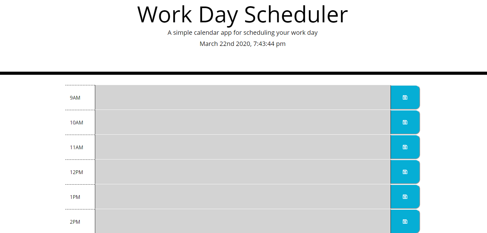

# Day Planner

# Deploy
Visit the page https://jasmith188.github.io/DayPlanner/ to the demo the app

# Information
For users that need to keep track of a lot of information, it's easy to forget or be unable to recall something important. Being able to take persistent notes allows users to have written information available when needed.

# Usage
This application will use an express backend and save and retrieve note data from a JSON file.

## License
[MIT](https://choosealicense.com/licenses/mit/)